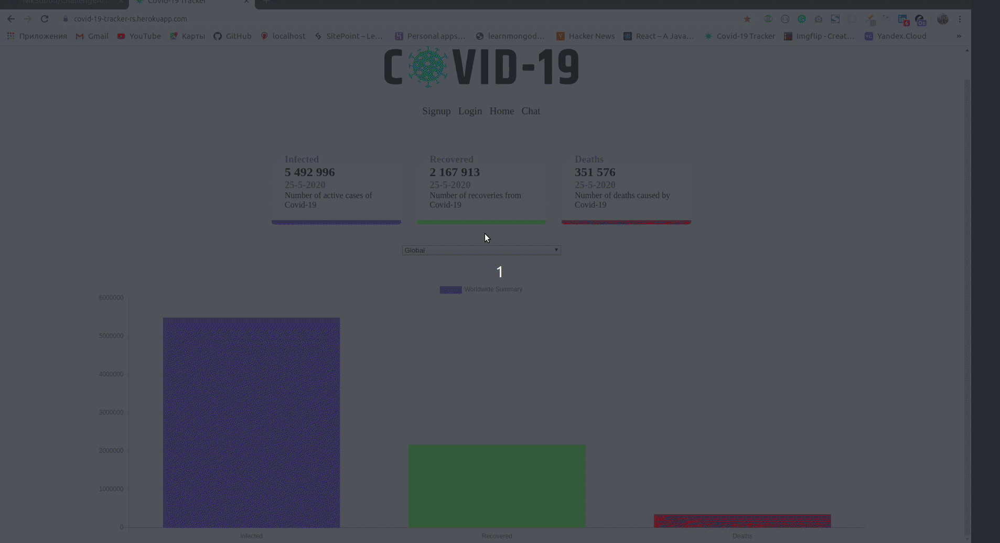

#<a href="https://covid-19-tracker-rs.herokuapp.com/">Covid-19-App</a>
CoVid-19 tracking web-app with registration/authentication and built-in realtime text-chat.  
Project was built in Node.js using Express, mongoDB, and Handlebars templates for views.
Data about infected people comes from a public Covid-19 API.
You can check out the app on the link above.

